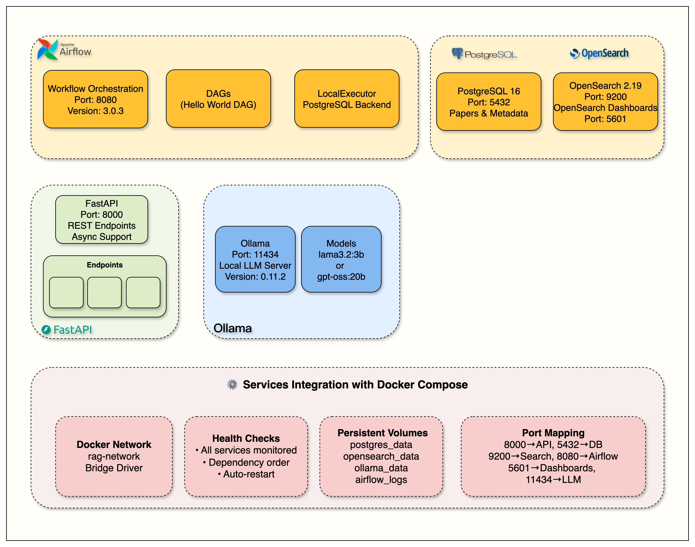
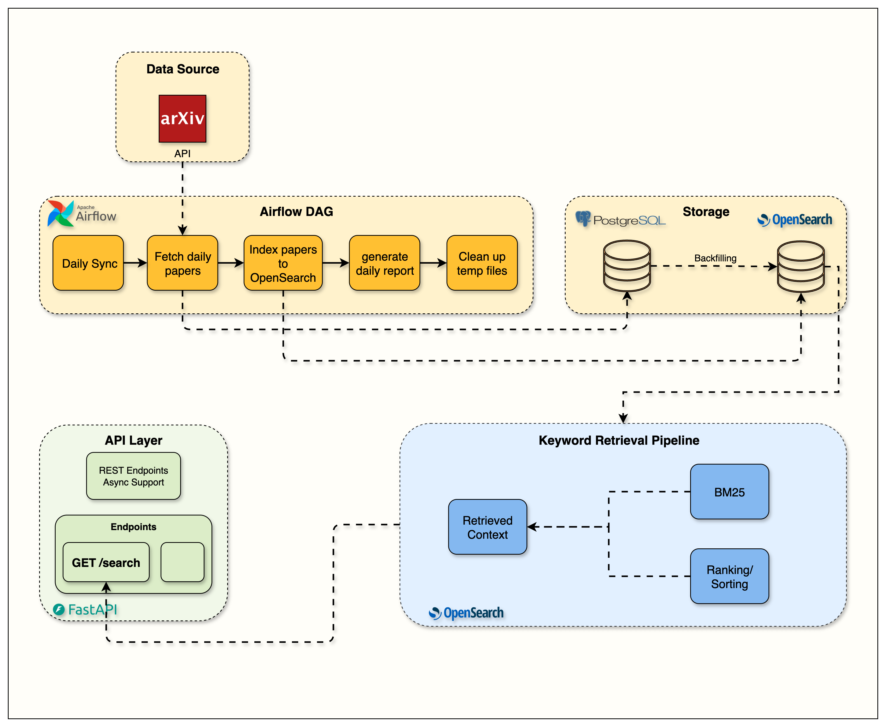
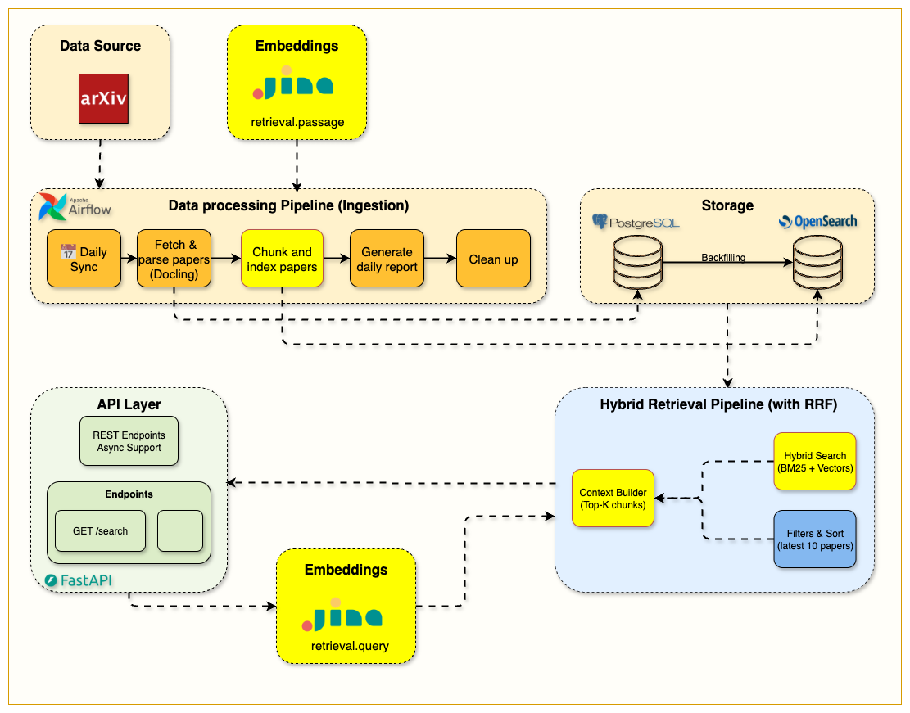

# The Mother of AI Project
## Phase 1 RAG Systems: arXiv Paper Curator

<div align="center">
  <h3>A Learner-Focused Journey into Production RAG Systems</h3>
  <p>Learn to build modern AI systems from the ground up through hands-on implementation</p>
  <p>Master the most in-demand AI engineering skills: <strong>RAG (Retrieval-Augmented Generation)</strong></p>
</div>

<p align="center">
  
  
  
  
  
</p>

</br>

<p align="center">
  <a href="#-about-this-course">
    
  </a>
</p>

## 📖 About This Course

This is a **learner-focused project** where you'll build a complete research assistant system that automatically fetches academic papers, understands their content, and answers your research questions using advanced RAG techniques.

**The arXiv Paper Curator** will teach you to build a **production-grade RAG system using industry best practices**. Unlike tutorials that jump straight to vector search, we follow the **professional path**: master keyword search foundations first, then enhance with vectors for hybrid retrieval.

> **🎯 The Professional Difference:** We build RAG systems the way successful companies do - solid search foundations enhanced with AI, not AI-first approaches that ignore search fundamentals.

By the end of this course, you'll have your own AI research assistant and the deep technical skills to build production RAG systems for any domain.

### **🎓 What You'll Build**

- **Week 1:** Complete infrastructure with Docker, FastAPI, PostgreSQL, OpenSearch, and Airflow
- **Week 2:** Automated data pipeline fetching and parsing academic papers from arXiv  
- **Week 3:** Production BM25 keyword search with filtering and relevance scoring
- **Week 4:** ✨ **Intelligent chunking + hybrid search combining keywords with semantic understanding**
- **Week 5:** Full RAG pipeline with LLM integration for answer generation
- **Week 6:** Evaluation system to measure and improve RAG performance

---

## 🚀 Quick Start

### **📋 Prerequisites**
- **Docker Desktop** (with Docker Compose)  
- **Python 3.12+**
- **UV Package Manager** ([Install Guide](https://docs.astral.sh/uv/getting-started/installation/))
- **8GB+ RAM** and **20GB+ free disk space**

### **⚡ Get Started**

```bash
# 1. Clone and setup
git clone <repository-url>
cd arxiv-paper-curator

# 2. Configure environment (IMPORTANT!)
cp .env.example .env
# The .env file contains all necessary configuration for OpenSearch, 
# arXiv API, and service connections. Defaults work out of the box.
# For Week 4: Add JINA_API_KEY=your_key_here for hybrid search

# 3. Install dependencies
uv sync

# 4. Start all services
docker compose up --build -d

# 5. Verify everything works
curl http://localhost:8000/health
```

### **📚 Weekly Learning Path**

| Week | Topic | Blog Post | Code Release |
|------|-------|-----------|--------------|
| **Week 0** | The Mother of AI project - 6 phases | [The Mother of AI project](https://jamwithai.substack.com/p/the-mother-of-ai-project) | - |
| **Week 1** | Infrastructure Foundation | [The Infrastructure That Powers RAG Systems](https://jamwithai.substack.com/p/the-infrastructure-that-powers-rag) | [week1.0](https://github.com/jamwithai/arxiv-paper-curator/releases/tag/week1.0) |
| **Week 2** | Data Ingestion Pipeline | [Building Data Ingestion Pipelines for RAG](https://jamwithai.substack.com/p/bringing-your-rag-system-to-life) | [week2.0](https://github.com/jamwithai/arxiv-paper-curator/releases/tag/week2.0) |
| **Week 3** | OpenSearch ingestion & BM25 retrieval | [The Search Foundation Every RAG System Needs](https://jamwithai.substack.com/p/the-search-foundation-every-rag-system) | [week3.0](https://github.com/jamwithai/arxiv-paper-curator/releases/tag/week3.0) |
| **Week 4** | **Chunking & Hybrid Search** | [The Chunking Strategy That Makes Hybrid Search Work](https://jamwithai.substack.com/p/the-chunking-strategy-that-makes-hybrid-search-work) | _Coming Soon_ |
| **Week 5** | Full RAG Pipeline | _Coming Soon_ | _Coming Soon_ |
| **Week 6** | Setting up evals | _Coming Soon_ | _Coming Soon_ |

**📥 Clone a specific week's release:**
```bash
# Clone a specific week's code
git clone --branch <WEEK_TAG> https://github.com/jamwithai/arxiv-paper-curator
cd arxiv-paper-curator
uv sync
docker compose down -v
docker compose up --build -d

# Replace <WEEK_TAG> with: week1.0, week2.0, etc.
```

### **📊 Access Your Services**

| Service | URL | Purpose |
|---------|-----|---------|
| **API Documentation** | http://localhost:8000/docs | Interactive API testing |
| **Airflow Dashboard** | http://localhost:8080 | Workflow management |
| **OpenSearch Dashboards** | http://localhost:5601 | Hybrid search engine UI |

#### **NOTE**: Check airflow/simple_auth_manager_passwords.json.generated for Airflow username and password
---

## 📚 Week 1: Infrastructure Foundation ✅

**Start here!** Master the infrastructure that powers modern RAG systems.

### **🎯 Learning Objectives**
- Complete infrastructure setup with Docker Compose
- FastAPI development with automatic documentation and health checks
- PostgreSQL database configuration and management
- OpenSearch hybrid search engine setup
- Ollama local LLM service configuration
- Service orchestration and health monitoring
- Professional development environment with code quality tools

### **🏗️ Architecture Overview**

<p align="center">
  
</p>

**Infrastructure Components:**
- **FastAPI**: REST endpoints with async support (Port 8000)  
- **PostgreSQL 16**: Paper metadata storage (Port 5432)
- **OpenSearch 2.19**: Search engine with dashboards (Ports 9200, 5601)
- **Apache Airflow 3.0**: Workflow orchestration (Port 8080)
- **Ollama**: Local LLM server (Port 11434)

### **📓 Setup Guide**

```bash
# Launch the Week 1 notebook
uv run jupyter notebook notebooks/week1/week1_setup.ipynb
```

### **✅ Success Criteria**
Complete when you can:
- [ ] Start all services with `docker compose up -d`
- [ ] Access API docs at http://localhost:8000/docs  
- [ ] Login to Airflow at http://localhost:8080
- [ ] Browse OpenSearch at http://localhost:5601
- [ ] All tests pass: `uv run pytest`

### **📖 Deep Dive**
**Blog Post:** [The Infrastructure That Powers RAG Systems](https://jamwithai.substack.com/p/the-infrastructure-that-powers-rag) - Detailed walkthrough and production insights

---

## 📚 Week 2: Data Ingestion Pipeline ✅

**Building on Week 1 infrastructure:** Learn to fetch, process, and store academic papers automatically.

### **🎯 Learning Objectives**
- arXiv API integration with rate limiting and retry logic
- Scientific PDF parsing using Docling
- Automated data ingestion pipelines with Apache Airflow
- Metadata extraction and storage workflows
- Complete paper processing from API to database

### **🏗️ Architecture Overview**

<p align="center">
  
</p>

**Data Pipeline Components:**
- **MetadataFetcher**: 🎯 Main orchestrator coordinating the entire pipeline
- **ArxivClient**: Rate-limited paper fetching with retry logic
- **PDFParserService**: Docling-powered scientific document processing  
- **Airflow DAGs**: Automated daily paper ingestion workflows
- **PostgreSQL Storage**: Structured paper metadata and content

### **📓 Implementation Guide**

```bash
# Launch the Week 2 notebook  
uv run jupyter notebook notebooks/week2/week2_arxiv_integration.ipynb
```

### **💻 Code Examples**

**arXiv API Integration:**
```python
# Example: Fetch papers with rate limiting
from src.services.arxiv.factory import make_arxiv_client

async def fetch_recent_papers():
    client = make_arxiv_client()
    papers = await client.search_papers(
        query="cat:cs.AI",
        max_results=10,
        from_date="20240801",
        to_date="20240807"
    )
    return papers
```

**PDF Processing Pipeline:**
```python
# Example: Parse PDF with Docling
from src.services.pdf_parser.factory import make_pdf_parser_service

async def process_paper_pdf(pdf_url: str):
    parser = make_pdf_parser_service()
    parsed_content = await parser.parse_pdf_from_url(pdf_url)
    return parsed_content  # Structured content with text, tables, figures
```

**Complete Ingestion Workflow:**
```python
# Example: Full paper ingestion pipeline
from src.services.metadata_fetcher import make_metadata_fetcher

async def ingest_papers():
    fetcher = make_metadata_fetcher()
    results = await fetcher.fetch_and_store_papers(
        query="cat:cs.AI",
        max_results=5,
        from_date="20240807"
    )
    return results  # Papers stored in database with full content
```

### **✅ Success Criteria**
Complete when you can:
- [ ] Fetch papers from arXiv API: Test in Week 2 notebook
- [ ] Parse PDF content with Docling: View extracted structured content
- [ ] Run Airflow DAG: `arxiv_paper_ingestion` executes successfully
- [ ] Verify database storage: Papers appear in PostgreSQL with full content
- [ ] API endpoints work: `/papers` returns stored papers with metadata

### **📖 Deep Dive**
**Blog Post:** [Building Data Ingestion Pipelines for RAG](https://jamwithai.substack.com/p/bringing-your-rag-system-to-life) - arXiv API integration and PDF processing

---

## 📚 Week 3: Keyword Search First - The Critical Foundation ⚡

> **🚨 The 90% Problem:** Most RAG systems jump straight to vector search and miss the foundation that powers the best retrieval systems. We're doing it right!

**Building on Weeks 1-2 foundation:** Implement the keyword search foundation that professional RAG systems rely on.

### **🎯 Why Keyword Search First?**

**The Reality Check:** Vector search alone is not enough. The most effective RAG systems use **hybrid retrieval** - combining keyword search (BM25) with vector search. Here's why we start with keywords:

1. **🔍 Exact Match Power:** Keywords excel at finding specific terms, technical jargon, and precise phrases
2. **📊 Interpretable Results:** You can understand exactly why a document was retrieved  
3. **⚡ Speed & Efficiency:** BM25 is computationally fast and doesn't require expensive embedding models
4. **🎯 Domain Knowledge:** Technical papers often require exact terminology matches that vector search might miss
5. **📈 Production Reality:** Companies like Elasticsearch, Algolia, and enterprise search all use keyword search as their foundation

### **🏗️ Week 3 Architecture Overview**

<p align="center">
  
  <br>
  <em>Complete Week 3 architecture showing the OpenSearch integration flow</em>
</p>

**Search Infrastructure:** Master full-text search with OpenSearch before adding vector complexity.

#### **🎯 Learning Objectives**
- **Foundation First:** Why keyword search is essential for RAG systems
- **OpenSearch Mastery:** Index management, mappings, and search optimization
- **BM25 Algorithm:** Understanding the math behind effective keyword search
- **Query DSL:** Building complex search queries with filters and boosting
- **Search Analytics:** Measuring search relevance and performance
- **Production Patterns:** How real companies structure their search systems

#### **Key Components**
- `src/services/opensearch/`: Professional search service implementation
- `src/routers/search.py`: Search API endpoints with BM25 scoring
- `notebooks/week3/`: Complete OpenSearch integration guide  
- **Search Quality Metrics:** Precision, recall, and relevance scoring

#### **💡 The Pedagogical Approach**
```
Week 3: Master keyword search (BM25) ← YOU ARE HERE
Week 4: Add intelligent chunking strategies  
Week 5: Introduce vector embeddings for hybrid retrieval
Week 6: Optimize the complete hybrid system
```

**This progression mirrors how successful companies build search systems - solid foundation first, then enhance with advanced techniques.**

### **📓 Week 3 Implementation Guide**

```bash
# Launch the Week 3 notebook
uv run jupyter notebook notebooks/week3/week3_opensearch.ipynb
```

### **💻 Code Examples**

**BM25 Search Implementation:**
```python
# Example: Search papers with BM25 scoring
from src.services.opensearch.factory import make_opensearch_client

async def search_papers():
    client = make_opensearch_client()
    results = await client.search_papers(
        query="transformer attention mechanism",
        max_results=10,
        categories=["cs.AI", "cs.LG"]
    )
    return results  # Papers ranked by BM25 relevance
```

**Search API Usage:**
```python
# Example: Use the search endpoint
import httpx

async def query_papers():
    async with httpx.AsyncClient() as client:
        response = await client.post("http://localhost:8000/api/v1/search", json={
            "query": "neural networks optimization",
            "max_results": 5,
            "latest_papers": True
        })
        return response.json()
```

### **✅ Success Criteria**
Complete when you can:
- [ ] Index papers in OpenSearch: Papers searchable via OpenSearch Dashboards
- [ ] Search via API: `/search` endpoint returns relevant papers with BM25 scoring
- [ ] Filter by categories: Search within specific arXiv categories (cs.AI, cs.LG, etc.)
- [ ] Sort by relevance or date: Toggle between BM25 scoring and latest papers
- [ ] View search analytics: Understanding why papers matched your query

### **📖 Deep Dive**
**Blog Post:** [The Search Foundation Every RAG System Needs](https://jamwithai.substack.com/p/the-search-foundation-every-rag-system) - Complete BM25 implementation with OpenSearch

---

## 📚 Week 4: Chunking & Hybrid Search - The Semantic Layer 🔥

> **🚀 The Intelligence Upgrade:** Now we enhance our solid BM25 foundation with semantic understanding through intelligent chunking and hybrid retrieval.

**Building on Week 3 foundation:** Add the semantic layer that makes search truly intelligent.

### **🎯 Why Chunking + Hybrid Search?**

**The Next Level:** With solid BM25 search proven, we can now intelligently add semantic capabilities:

1. **🧩 Smart Chunking:** Break documents into coherent, searchable segments that preserve context
2. **🤖 Semantic Understanding:** Find relevant content even when users paraphrase or use synonyms  
3. **⚖️ Hybrid Excellence:** Combine keyword precision with semantic recall using RRF fusion
4. **📊 Best of Both Worlds:** Fast exact matching + deep semantic understanding
5. **🏭 Production Reality:** How modern RAG systems actually work in practice

### **🏗️ Week 4 Architecture Overview**

<p align="center">
  
  <br>
  <em>Complete Week 4 hybrid search architecture with chunking, embeddings, and RRF fusion</em>
</p>

**Hybrid Search Infrastructure:** Production-grade chunking strategies with unified search supporting BM25, vector, and hybrid modes.

#### **🎯 Learning Objectives**
- **Section-Based Chunking:** Intelligent document segmentation that respects structure
- **Production Embeddings:** Jina AI integration with fallback strategies  
- **Hybrid Search Mastery:** RRF fusion combining keyword + semantic retrieval
- **Unified API Design:** Single endpoint supporting multiple search modes
- **Performance Analysis:** Understanding trade-offs between search approaches

#### **Key Components**
- `src/services/indexing/text_chunker.py`: Section-aware chunking with overlap strategies
- `src/services/embeddings/`: Production embedding pipeline with Jina AI
- `src/routers/hybrid_search.py`: Unified search API supporting all modes  
- `notebooks/week4/`: Complete hybrid search implementation guide

### **📓 Week 4 Implementation Guide**

```bash
# Launch the Week 4 notebook
uv run jupyter notebook notebooks/week4/week4_hybrid_search.ipynb
```

### **💻 Code Examples**

**Section-Based Chunking:**
```python
# Example: Intelligent document chunking
from src.services.indexing.text_chunker import TextChunker

chunker = TextChunker(chunk_size=600, overlap_size=100)
chunks = chunker.chunk_paper(
    title="Attention Mechanisms in Neural Networks",
    abstract="Recent advances in attention...",
    full_text=paper_content,
    sections=parsed_sections  # From Docling PDF parsing
)
# Result: Coherent chunks respecting document structure
```

**Hybrid Search Implementation:**
```python  
# Example: Unified search supporting multiple modes
async def search_papers(query: str, use_hybrid: bool = True):
    async with httpx.AsyncClient() as client:
        response = await client.post("http://localhost:8000/api/v1/hybrid-search/", json={
            "query": query,
            "use_hybrid": use_hybrid,  # Auto-generates embeddings
            "size": 10,
            "categories": ["cs.AI"]
        })
        return response.json()
        
# BM25 only: Fast keyword matching (~50ms)
bm25_results = await search_papers("transformer attention", use_hybrid=False)

# Hybrid search: Semantic + keyword understanding (~400ms)  
hybrid_results = await search_papers("how to make models more efficient", use_hybrid=True)
```

### **✅ Success Criteria**
Complete when you can:
- [ ] Chunk documents intelligently: Papers broken into coherent 600-word segments
- [ ] Generate embeddings: Jina AI integration working with automatic query embedding
- [ ] Hybrid search working: RRF fusion combining BM25 + vector similarity
- [ ] Compare search modes: Understand when to use BM25 vs hybrid search
- [ ] Production API ready: `/hybrid-search` endpoint handling all search types

### **📊 Performance Benchmarks**
| Search Mode | Speed | Precision@10 | Recall@10 | Use Case |
|-------------|-------|--------------|-----------|----------|
| **BM25 Only** | ~50ms | 0.67 | 0.71 | Exact keywords, author names |
| **Hybrid (RRF)** | ~400ms | 0.84 | 0.89 | Conceptual queries, synonyms |

### **📖 Deep Dive**  
**Blog Post:** [The Chunking Strategy That Makes Hybrid Search Work](link-to-week4-blog) - Production chunking and RRF fusion implementation

### **Future Weeks Overview** (Weeks 5-6)
- **Week 5:** Full RAG pipeline with LLM integration and answer generation
- **Week 6:** Observability, evaluation, and production optimization

---

## ⚙️ Configuration Management

### **Environment Configuration**

The project uses a **unified `.env` file** with nested configuration structure to manage settings across all services.

#### **Configuration Structure**
```bash
# Application Settings
DEBUG=true
ENVIRONMENT=development

# arXiv API (Week 2)
ARXIV__MAX_RESULTS=15
ARXIV__SEARCH_CATEGORY=cs.AI
ARXIV__RATE_LIMIT_DELAY=3.0

# PDF Parser (Week 2)  
PDF_PARSER__MAX_PAGES=30
PDF_PARSER__DO_OCR=false

# OpenSearch (Week 3)
OPENSEARCH__HOST=http://opensearch:9200
OPENSEARCH__INDEX_NAME=arxiv-papers

# Jina AI Embeddings (Week 4)
JINA_API_KEY=your_jina_api_key_here
EMBEDDINGS__MODEL=jina-embeddings-v3
EMBEDDINGS__TASK=retrieval.passage
EMBEDDINGS__DIMENSIONS=1024

# Chunking Configuration (Week 4)
CHUNKING__CHUNK_SIZE=600
CHUNKING__OVERLAP_SIZE=100
CHUNKING__MIN_CHUNK_SIZE=100

# Services
OLLAMA_HOST=http://ollama:11434
OLLAMA_MODEL=llama3.2:1b
```

#### **Key Configuration Variables**

| Variable | Default | Description |
|----------|---------|-------------|
| `DEBUG` | `true` | Debug mode for development |
| `ARXIV__MAX_RESULTS` | `15` | Papers to fetch per API call |
| `ARXIV__SEARCH_CATEGORY` | `cs.AI` | arXiv category to search |
| `PDF_PARSER__MAX_PAGES` | `30` | Max pages to process per PDF |
| `OPENSEARCH__INDEX_NAME` | `arxiv-papers` | OpenSearch index name |
| `OPENSEARCH__HOST` | `http://opensearch:9200` | OpenSearch cluster endpoint |
| `JINA_API_KEY` | Required for Week 4 | Jina AI API key for embeddings |
| `CHUNKING__CHUNK_SIZE` | `600` | Target words per document chunk |
| `CHUNKING__OVERLAP_SIZE` | `100` | Overlapping words between chunks |
| `EMBEDDINGS__MODEL` | `jina-embeddings-v3` | Jina embeddings model |
| `OLLAMA_MODEL` | `llama3.2:1b` | Local LLM model |

#### **Service-Aware Configuration**

The configuration system automatically detects the service context:
- **API Service**: Uses `localhost` for database and service connections
- **Airflow Service**: Uses Docker container hostnames (`postgres`, `opensearch`)

```python
# Configuration is automatically loaded based on context
from src.config import get_settings

settings = get_settings()  # Auto-detects API vs Airflow
print(f"ArXiv max results: {settings.arxiv.max_results}")
```

---

## 🔧 Reference & Development Guide

### **🛠️ Technology Stack**

| Service | Purpose | Status |
|---------|---------|--------|
| **FastAPI** | REST API with automatic docs | ✅ Ready |
| **PostgreSQL 16** | Paper metadata and content storage | ✅ Ready |
| **OpenSearch 2.19** | Hybrid search engine (BM25 + Vector) | ✅ Ready |
| **Apache Airflow 3.0** | Workflow automation | ✅ Ready |
| **Jina AI** | Embedding generation (Week 4) | ✅ Ready |
| **Ollama** | Local LLM serving (Week 5) | ✅ Ready |

**Development Tools:** UV, Ruff, MyPy, Pytest, Docker Compose

### **🏗️ Project Structure**

```
arxiv-paper-curator/
├── src/                                    # Main application code
│   ├── main.py                             # FastAPI application
│   ├── routers/                            # API endpoints
│   │   ├── ping.py                         # Health check endpoints
│   │   ├── papers.py                       # Paper retrieval endpoints
│   │   └── hybrid_search.py                # 🆕 NEW: Week 4 hybrid search endpoints
│   ├── models/                             # Database models (SQLAlchemy)
│   ├── repositories/                       # Data access layer
│   ├── schemas/                            # Pydantic validation schemas
│   │   ├── api/                            # API request/response schemas
│   │   │   ├── health.py                   # Health check schemas
│   │   │   └── search.py                   # Search request/response schemas
│   │   ├── arxiv/                          # arXiv data schemas
│   │   ├── pdf_parser/                     # PDF parsing schemas
│   │   ├── database/                       # 🆕 NEW: Database configuration schemas
│   │   ├── indexing/                       # 🆕 NEW: Week 4 chunking schemas
│   │   └── embeddings/                     # 🆕 NEW: Week 4 embedding schemas
│   ├── services/                           # Business logic
│   │   ├── arxiv/                          # arXiv API client
│   │   ├── pdf_parser/                     # Docling PDF processing
│   │   ├── opensearch/                     # OpenSearch integration
│   │   │   ├── client.py                   # Unified search client (BM25 + Vector + Hybrid)
│   │   │   ├── factory.py                  # Client factory pattern
│   │   │   ├── index_config_hybrid.py      # 🆕 NEW: Week 4 hybrid index configuration
│   │   │   └── query_builder.py            # BM25 query construction
│   │   ├── indexing/                       # 🆕 NEW: Week 4 document processing
│   │   │   ├── text_chunker.py             # Section-based chunking strategy
│   │   │   ├── hybrid_indexer.py           # Document indexing with embeddings
│   │   │   └── factory.py                  # Indexing service factory
│   │   ├── embeddings/                     # 🆕 NEW: Week 4 embedding services
│   │   │   ├── jina_client.py              # Jina AI embedding service
│   │   │   └── factory.py                  # Embedding service factory
│   │   ├── metadata_fetcher.py             # Complete ingestion pipeline
│   │   └── ollama/                         # Ollama LLM service
│   ├── db/                                 # Database configuration
│   ├── config.py                           # Environment configuration
│   └── dependencies.py                     # Dependency injection
│
├── notebooks/                              # Learning materials
│   ├── week1/                              # Week 1: Infrastructure setup
│   │   └── week1_setup.ipynb               # Complete setup guide
│   ├── week2/                              # Week 2: Data ingestion
│   │   └── week2_arxiv_integration.ipynb   # Data pipeline guide
│   ├── week3/                              # Week 3: Keyword search
│   │   └── week3_opensearch.ipynb          # OpenSearch & BM25 guide
│   └── week4/                              # Week 4: Chunking & hybrid search
│       ├── week4_hybrid_search.ipynb       # Complete hybrid search guide
│       └── README.md                       # Week 4 implementation documentation
│
├── airflow/                                # Workflow orchestration
│   ├── dags/                               # Workflow definitions
│   │   ├── arxiv_ingestion/                # arXiv ingestion modules
│   │   └── arxiv_paper_ingestion.py        # Main ingestion DAG
│   └── requirements-airflow.txt            # Airflow dependencies
│
├── tests/                                  # Comprehensive test suite
├── static/                                 # Assets (images, GIFs)
└── compose.yml                             # Service orchestration
```

### **📡 API Endpoints Reference**

| Endpoint | Method | Description | Week |
|----------|--------|-------------|------|
| `/health` | GET | Service health check | Week 1 |
| `/api/v1/papers` | GET | List stored papers | Week 2 |
| `/api/v1/papers/{id}` | GET | Get specific paper | Week 2 |
| `/api/v1/search` | POST | BM25 keyword search | Week 3 |
| `/api/v1/hybrid-search/` | POST | Hybrid search (BM25 + Vector) | **Week 4** |

**API Documentation:** Visit http://localhost:8000/docs for interactive API explorer

### **🔧 Essential Commands**

#### **Using the Makefile** (Recommended)
```bash
# View all available commands
make help

# Quick workflow
make start         # Start all services
make health        # Check all services health
make test          # Run tests
make stop          # Stop services
```

#### **All Available Commands**
| Command | Description |
|---------|-------------|
| `make start` | Start all services |
| `make stop` | Stop all services |
| `make restart` | Restart all services |
| `make status` | Show service status |
| `make logs` | Show service logs |
| `make health` | Check all services health |
| `make setup` | Install Python dependencies |
| `make format` | Format code |
| `make lint` | Lint and type check |
| `make test` | Run tests |
| `make test-cov` | Run tests with coverage |
| `make clean` | Clean up everything |

#### **Direct Commands** (Alternative)
```bash
# If you prefer using commands directly
docker compose up --build -d    # Start services
docker compose ps               # Check status
docker compose logs            # View logs
uv run pytest                 # Run tests
```

### **🎓 Target Audience**
| Who | Why |
|-----|-----|
| **AI/ML Engineers** | Learn production RAG architecture beyond tutorials |
| **Software Engineers** | Build end-to-end AI applications with best practices |
| **Data Scientists** | Implement production AI systems using modern tools |

---

## 🛠️ Troubleshooting

**Common Issues:**
- **Services not starting?** Wait 2-3 minutes, check `docker compose logs`
- **Port conflicts?** Stop other services using ports 8000, 8080, 5432, 9200
- **Memory issues?** Increase Docker Desktop memory allocation

**Get Help:**
- Check the comprehensive Week 1 notebook troubleshooting section
- Review service logs: `docker compose logs [service-name]`
- Complete reset: `docker compose down --volumes && docker compose up --build -d`

---

## 💰 Cost Structure

**This course is completely free!** You'll only need minimal costs for optional services:
- **Local Development:** $0 (everything runs locally)
- **Optional Cloud APIs:** ~$2-5 for external LLM services (if chosen)

---

<div align="center">
  <h3>🎉 Ready to Start Your AI Engineering Journey?</h3>
  <p><strong>Begin with the Week 1 setup notebook and build your first production RAG system!</strong></p>
  
  <p><em>For learners who want to master modern AI engineering</em></p>
  <p><strong>Built with love by Jam With AI</strong></p>
</div>

---

## 📄 License

MIT License - see [LICENSE](LICENSE) file for details.
